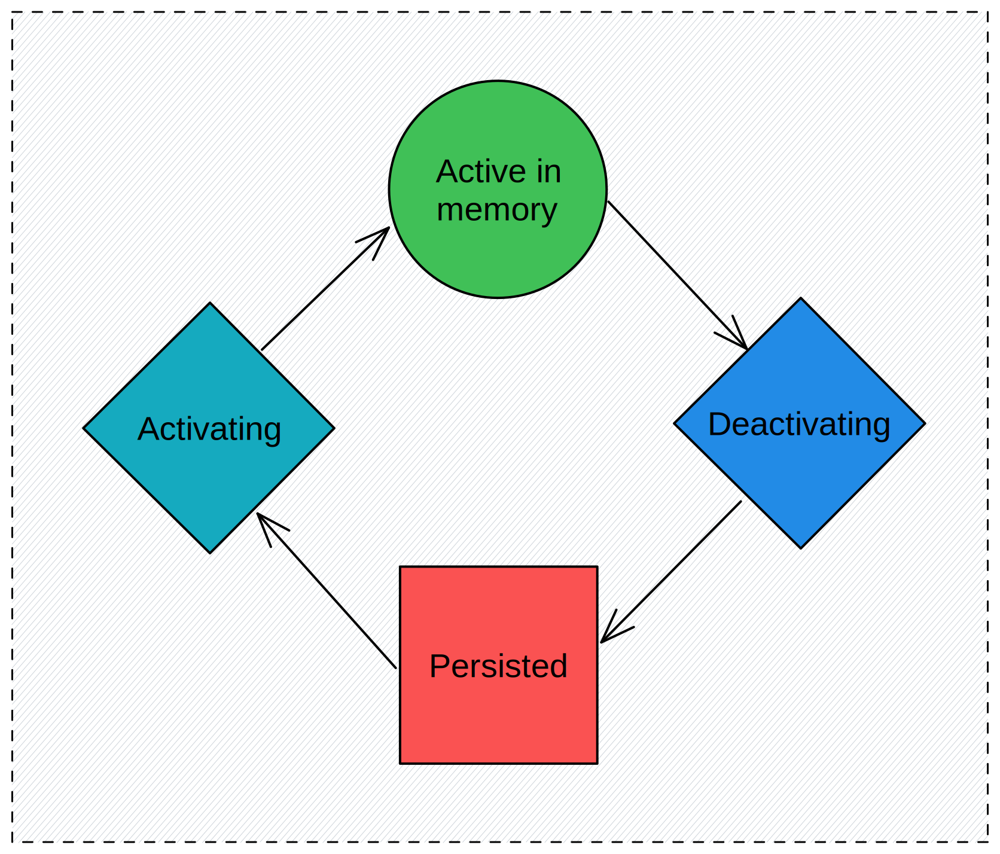
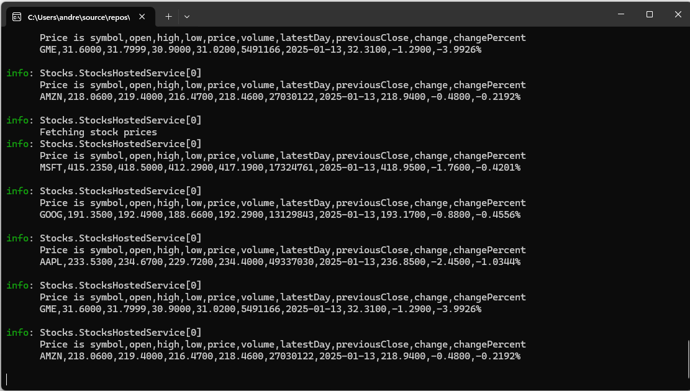
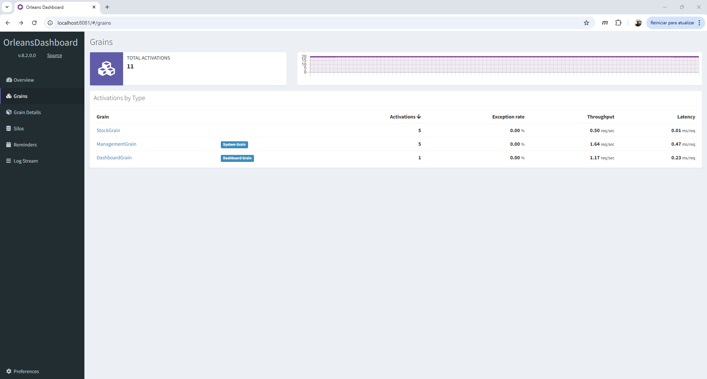
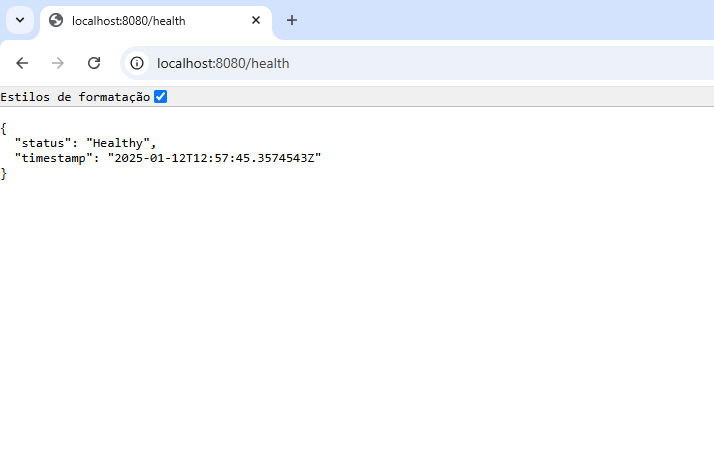

# Por que utilizar o Microsoft Orleans

## Introdução

Quando temos uma API, atrás de um balanceador de carga, é possível ter diversas tarefas (**ECS tasks**) de um determinado serviço, em um *cluster* (**ECS cluster**), numa conta da **AWS**, e assim, podemos ter alta disponibilidade e escalabilidade. Outros cenários podem ser resolvidos através de utilização de **Lambda Functions**. No entanto, se tivermos um serviço do tipo *worker*, em **C#**, baseado no <a href="https://learn.microsoft.com/pt-br/dotnet/core/extensions/windows-service" target="_blank">BackgroundService</a>, que realiza determinado processamento em um intervalo de tempo, como podemos ter alta disponibilidade e escalabilidade? Se definirmos, por exemplo, 2 tarefas, na tentativa de resolver essas questões, os processamentos poderão ocorrer em duplicidade. Se criamos um mecanismo, onde mesmo que o processamento ocorra em duplicidade, o resultado não seja duplicado, não estaremos sendo eficiente no que se refere a custos e não será possível escalar horizontalmente, porque não importa a quantidade de tarefas, todas sempre vão ter a mesma carga de processamento. Se criarmos algum mecanismo para que apenas uma das tarefas realize os processamentos enquanto a outra fique em *stand by*, caso a primeira tarefa fique indisponível por qualquer motivo, de novo, vamos gastar o dobro que seria necessário, além disso não será possível escalar horizontalmente.

Este é um dos cenários onde o **Microsoft Orleans** se mostra necessário, com esse framework é possível ter diversas instâncias de um mesmo serviço, com processamentos únicos, onde essas instâncias distribuem a carga entre si, tendo assim, uma aplicação com alta disponibilidade e escalabilidade.

## O que é Microsoft Orleans?

O **Microsoft Orleans** é um *framework* projetado para simplificar a construção de sistemas distribuídos e escaláveis, sendo especialmente útil para aplicações que precisam lidar com alta concorrência e gerenciar estado de forma eficiente. Baseado no modelo de ator virtual, o Orleans introduz o conceito de "grãos" (*grains*), que são unidades de lógica e estado, permitindo que os desenvolvedores criem aplicações distribuídas sem se preocupar diretamente com a complexidade de sincronização, localização de recursos e concorrência.

Entre seus principais benefícios estão a escalabilidade horizontal transparente, o balanceamento dinâmico de carga e a integração com persistência de estado, o que facilita o desenvolvimento de sistemas resilientes e de alta performance. Além disso, o **Orleans** utiliza conceitos familiares da <a href="https://learn.microsoft.com/pt-br/dotnet/csharp/fundamentals/tutorials/oop" target="_blank">Programação Orientada a Objetos</a> (POO), tornando-se acessível mesmo para quem não possui experiência prévia com sistemas distribuídos.

Com aplicações em jogos *online*, processamento em tempo real, sistemas *IoT* e muito mais, o **Microsoft Orleans** é uma ferramenta poderosa para quem busca criar sistemas robustos sem "reinventar a roda". Essa abordagem tem atraído desenvolvedores que buscam simplicidade e produtividade, oferecendo uma alternativa moderna e eficiente para resolver desafios complexos de distribuição e escalabilidade.

## Criação do Microsoft Orleans

O **Microsoft Orleans** foi criado para atender às necessidades específicas da Microsoft na construção de sistemas distribuídos para aplicações massivamente escaláveis, como jogos online e serviços de *backend* em larga escala. Ele surgiu como uma resposta aos desafios enfrentados ao usar abordagens tradicionais de sistemas distribuídos, que muitas vezes exigem soluções customizadas e complexas para lidar com problemas de concorrência, estado distribuído e escalabilidade.

A principal inspiração por trás do **Orleans** foi o modelo de ator, um paradigma de computação distribuída em que "atores" representam unidades independentes de lógica e estado que se comunicam entre si por meio de mensagens assíncronas. Este modelo, inicialmente popularizado por *frameworks* como o *Erlang*, provou ser uma solução eficaz para sistemas distribuídos, mas a equipe do Orleans o adaptou para simplificar ainda mais o desenvolvimento, criando o conceito de ator virtual.

No **Orleans**, os atores são chamados de grãos (*grains*), e seu modelo elimina a necessidade de os desenvolvedores gerenciarem manualmente a ativação, a localização e a concorrência entre os atores. Cada grão é ativado automaticamente sob demanda, com seu estado gerenciado de forma transparente, enquanto o *runtime* do **Orleans** cuida de detalhes como distribuição, persistência e balanceamento de carga. Isso reduz drasticamente a complexidade do desenvolvimento e oferece uma abordagem mais acessível para criar sistemas distribuídos em larga escala.

Essa abordagem foi testada e refinada em aplicações de alta performance, como o backend do jogo ***Halo***, demonstrando sua eficácia no gerenciamento de milhões de jogadores simultâneos.

## Grãos e Silos

No **Microsoft Orleans**, grãos e silos são conceitos fundamentais que estruturam a arquitetura do framework para lidar com sistemas distribuídos. Aqui está uma explicação de cada um:

### Grãos (*Grains*):

Os grãos são as unidades fundamentais de lógica e estado no **Orleans**, representando "atores virtuais". Eles são objetos que encapsulam tanto o comportamento quanto o estado da aplicação, funcionando de forma independente.

> #### Principais características dos Grãos:
>
> - **Ator Virtual:** Diferente do modelo tradicional de ator, os grãos não têm uma instância fixa em memória. Eles são ativados automaticamente sob demanda e podem ser descarregados quando inativos.
>   
> - **Estado Persistente:** Podem armazenar seu estado em repositórios persistentes, como bancos de dados, sem que o desenvolvedor precise gerenciar isso manualmente.
>   
> - **Comunicação Assíncrona:** Os grãos se comunicam entre si usando mensagens assíncronas, o que facilita a criação de sistemas distribuídos que escalam de forma transparente.
>   
> - **Exemplo de uso:** Em um jogo multiplayer, um grão pode representar uma entidade como um jogador, um item ou uma sala de jogo, com cada um deles gerenciando seu próprio estado e lógica.
>   

### Silos:

Os silos são os contêineres que hospedam os grãos, proporcionando o ambiente necessário para que eles funcionem. Pense neles como os "nós" físicos ou virtuais que compõem a infraestrutura de um sistema **Orleans**. 

> #### Principais características do Silos: 
>
> - **Execução Distribuída:** Cada silo executa grãos e cuida da comunicação entre grãos localizados em diferentes silos.
>   
> - **Escalabilidade:** Novos silos podem ser adicionados dinamicamente para expandir o sistema, permitindo que ele escale horizontalmente.
>
> - **Gerenciamento de Grãos:** Os silos são responsáveis por ativar, desativar e localizar grãos conforme necessário.
>
>  - **Resiliência:** Silos interagem para garantir que falhas em um nó não comprometam o sistema como um todo.

### Relação entre Grãos e Silos:

Os grãos vivem dentro dos silos. Quando um grão precisa ser chamado, o silo cuida de ativá-lo e de armazenar seu estado em memória ou persistência. Vários silos podem trabalhar juntos para distribuir a carga de trabalho e garantir a alta disponibilidade e a escalabilidade do sistema. 

Um grupo de silos é conhecido como um *cluster*. Você pode organizar seus dados armazenando diferentes tipos de grãos em diferentes silos. Seu aplicativo pode recuperar grãos individuais sem precisar se preocupar com os detalhes de como elas são gerenciados dentro do cluster.

 e grãos")

#### Exemplo Simples:

•	**Grão:** Em uma aplicação de gerenciamento de pedidos, um grão pode representar um pedido específico, contendo detalhes como itens, status e histórico.

•	**Silo:** O servidor ou cluster de servidores onde esses grãos são hospedados e gerenciados.

Na parte final deste artigo aplicaremos o **MS Orleans** numa aplicação funcional.

### Ciclo de vida do grão


 
Esta imagem ilustra o ciclo de vida de um grão no **Microsoft Orleans**. Cada grão pode passar por diferentes estados ao longo de sua existência no sistema. Aqui está a explicação dos estados e transições representados:

<ol>
  <li><b><i>Activating</i> (Ativando):</b>
   <ul>
      <li><p>Quando um grão é acessado pela primeira vez ou quando precisa ser usado novamente, ele entra no estado de ativação.</p></li>
      <li><p>Durante este estado, o **Orleans** inicializa o grão, carregando-o na memória e restaurando seu estado persistente (se necessário).</p></li>
    </ul>
  </li>
  <li><b><i>Active in Memory</i> (Ativo na Memória):</b>
  <ul>
      <li><p>Após a ativação, o grão fica carregado na memória.</p></li>
      <li><p>Neste estado, o grão está pronto para processar solicitações de outros grãos ou de clientes.</p></li>
      <li><p>Ele permanece neste estado enquanto for necessário ou até que se torne inativo.</p></li>
    </ul>
  </li>
  <li><b><i>Deactivating</i> (Desativando):</b>
    <ul>
      <li><p>Quando o grão não é mais necessário, o **Orleans** inicia o processo de desativação.</p></li>
      <li><p>Durante este estado, o *framework* pode persistir o estado do grão (se for configurado para isso) antes de removê-lo da memória.</p></li>
    </ul>
  </li>
  <li><b><i>Persisted</i> (Persistido):</b>
    <ul>
       <li><p>Após a desativação, o estado do grão pode ser salvo em um armazenamento persistente (por exemplo, um banco de dados ou armazenamento em nuvem).</p></li>
       <li><p>O grão permanece persistido até que seja necessário novamente.</p></li>
    </ul>
  </li>
</ol>

#### Fluxo Geral:

- Um grão passa por ***"Activating"*** → ***"Active in Memory"*** quando é necessário.

- Quando o grão não está mais ativo, ele passa por "Deactivating" → "Persisted".

-	Se o grão persistido for requisitado novamente, ele retorna ao ciclo de ativação.

<br>

> #### Objetivo do Ciclo de Vida:
> Esse ciclo permite que o Orleans gerencie recursos de forma eficiente em um sistema distribuído. Ele garante que:
> 
> -	Grãos inativos não consumam memória.
>   
> - O estado do grão possa ser restaurado sempre que necessário.
>   
> - O sistema possa escalar dinamicamente, ativando e desativando grãos conforme a demanda.
> 
> Essa abordagem baseada no ciclo de vida automatiza o gerenciamento de estado e memória, facilitando a criação de aplicações distribuídas escaláveis e resilientes.

<br>

## Crie seu primeiro aplicativo Orleans com o ASP.NET Core

Vamos construir uma aplicação que busca preços de ações de um serviço remoto usando o <a href="https://learn.microsoft.com/pt-br/dotnet/api/system.net.http.httpclient?view=net-8.0" target="_blank">HttpClient</a>, armazena-os em cache em um grão e os exibe na tela.

É um projeto baseado no exemplo da Microsoft, porem com algumas alterações, disponível no repositório: <a href="https://github.com/dotnet/samples/tree/main/orleans/Stocks">https://github.com/dotnet/samples/tree/main/orleans/Stocks</a>

**Pré-requisitos**
- SDK .NET 8.0
- Visual Studio 2022


### Criar o aplicativo

1.	Inicie o **Visual Studio 2022** e selecione **Criar um novo projeto**.

2.	Na caixa de diálogo **Criar um novo projeto**, selecione ***API Web do ASP.NET Core***, em seguida, selecione **Avançar**.

3.	Na caixa de diálogo **Configurar novo projeto**, digite **Stocks** como Nome do projeto e selecione em **Avançar**.

4.	Na caixa de diálogo **Informações adicionais**, selecione **.NET 8.0** e desmarque **Usar controladores** e, em seguida, selecione **Criar**.

> Em algumas documentações você pode encontrar exemplos onde há um Server e um Client, nós vamos construir uma aplicação onde não vamos precisar do Client, vamos criar apenas o Server.


### Adicionar Orleans ao projeto

O **Orleans** está disponível por meio de uma coleção de pacotes ***NuGet*** e cada um deles fornece acesso a vários recursos. Neste projeto, adicione os pacotes **Microsoft.Orleans.Server** e **OrleansDashboard** ao aplicativo:

1.	Clique com o botão direito do mouse no nó do projeto **Stocks** no gerenciador de soluções e selecione **Gerenciar Pacotes NuGet**.

2.	Na janela do gerenciador de pacotes, pesquise **Orleans**.

3.	Escolha os pacotes **Microsoft.Orleans.Server** e **OrleansDashboard**, ambos na versão 8.2.0, nos resultados da pesquisa e selecione **Instalar**.


### Criar o Grão

Grãos são os blocos de construção primitivos mais essenciais de aplicativos do **Orleans**. Uma granularidade é uma classe que herda da classe base ***Grain***, que gerencia vários comportamentos internos e pontos de integração com **Orleans**. Os grãos devem implementar uma interface para definir o tipo de identificador da chave de granularidade.

No nosso caso vamos usar o ***IGrainWithStringKey***. Os grãos do **Orleans** também podem usar uma interface personalizada para definir seus métodos e propriedades. Nesta interface, vamos precisar apenas de um método, o ***GetPrice()***, que usaremos para obter os preços das ações.

1.	Crie uma interface usando o código a seguir:

```csharp
namespace Stocks.Interfaces;

public interface IStockGrain : IGrainWithStringKey
{
    Task<string> GetPrice();
}
```

2.	Crie uma classe usando o código a seguir. Essa classe herda da classe ***Grain*** fornecida por **Orleans** e implementa a interface ***IStockGrain***, criada anteriormente: 

```csharp
using Stocks.Interfaces;
using System.Transactions;

namespace Stocks.Grains;

public sealed class StockGrain : Grain, IStockGrain
{
    // Request api key from here https://www.alphavantage.co/support/#api-key
    private const string ApiKey = "KG94386YNL9JZUNW";
    private readonly HttpClient _httpClient = new();

    private string _price = null!;

    public override async Task OnActivateAsync(CancellationToken cancellationToken)
    {
        var stock = this.GetPrimaryKeyString();
        await UpdatePrice(stock);

        this.RegisterGrainTimer(
            UpdatePrice,
            stock,
            TimeSpan.FromMinutes(2),
            TimeSpan.FromMinutes(2));

        await base.OnActivateAsync(cancellationToken);
    }

    private async Task UpdatePrice(object stock)
    {
        var priceTask = GetPriceQuote((string)stock);

        // read the results
        _price = await priceTask;
    }

    private async Task<string> GetPriceQuote(string stock)
    {
        using var resp =
            await _httpClient.GetAsync(
                $"https://www.alphavantage.co/query?function=GLOBAL_QUOTE&symbol={stock}&apikey={ApiKey}&datatype=csv");

        return await resp.Content.ReadAsStringAsync();
    }

    public Task<string> GetPrice() => Task.FromResult(_price);
}
```
 
> Você pode requisitar uma ***api key***, gratuitamente, para testar a aplicação, através do link <a href="https://www.alphavantage.co/support/#api-key" target="_blank">https://www.alphavantage.co/support/#api-key</a>.

### Criar BackgroudService

Ele será responsável por ativar os grãos. Crie uma classe usando o código a seguir:

```csharp
using Microsoft.Extensions.Hosting;
using Microsoft.Extensions.Logging;
using Stocks.Interfaces;

namespace Stocks;

public sealed class StocksHostedService : BackgroundService
{
    private readonly ILogger<StocksHostedService> _logger;
    private readonly IClusterClient _client;
    private readonly List<string> _symbols = new() { "MSFT", "GOOG", "AAPL", "GME", "AMZN" };

    public StocksHostedService(ILogger<StocksHostedService> logger, IClusterClient client)
    {
        _logger = logger;
        _client = client;
    }

    protected override async Task ExecuteAsync(CancellationToken stoppingToken)
    {
        while (!stoppingToken.IsCancellationRequested)
        {
            try
            {
                _logger.LogInformation("Fetching stock prices");
                var tasks = new List<Task<string>>();

                // Fan out calls to each of the stock grains
                foreach (var symbol in _symbols)
                {
                    var stockGrain = _client.GetGrain<IStockGrain>(symbol);
                    tasks.Add(stockGrain.GetPrice());
                }

                // Collect the results
                await Task.WhenAll(tasks);

                // Print the results
                foreach (var task in tasks)
                {
                    var price = await task;
                    _logger.LogInformation("Price is {Price}", price);
                }

                await Task.Delay(TimeSpan.FromSeconds(10), stoppingToken);
            }
            catch (Exception error) when (!stoppingToken.IsCancellationRequested)
            {
                _logger.LogError(error, "Error fetching stock price");
            }
        }
    }
}
```

### Configurar os silos

Os silos responsáveis por armazenar e gerenciar granularidades. Um silo pode conter uma ou mais grãos. 

O código a seguir usa uma classe ***ISiloBuilder*** para criar um *cluster localhost*. Este cenário usa recursos locais para desenvolvimento, mas um aplicativo de produção pode ser configurado para usar clusters e armazenamento altamente escaláveis. Veremos mais adiante.

> Quando configuramos a execução da aplicação em vários silos, ou seja, vários hosts, a comunicação com os grãos ocorre como se todos estivessem disponíveis em um único processo.

Abra o arquivo *Program.cs* e substitua o conteúdo existente pelo seguinte código:

```csharp
using Stocks;

var builder = WebApplication.CreateBuilder();

builder.Host
    .UseOrleans(siloBuilder =>
    {
        siloBuilder.UseLocalhostClustering();
        siloBuilder.UseDashboard(options => { options.Port = 8081; });
    })
    .ConfigureServices(
        services => services.AddHostedService<StocksHostedService>());

var app = builder.Build();

app.MapGet("/", () => "Welcome to the Stock Sample, powered by Orleans!");

app.MapGet("/health", () => Results.Ok(new { status = "Healthy", timestamp = DateTime.UtcNow }));

app.Run();
```

### Teste o aplicativo localmente

A funcionalidade principal do aplicativo agora está completa e pronta para ser testada localmente.

Ao executar a aplicação localmente, abrirá um console, conforme mostrado abaixo:



Abra o navegador e acesse o endereço <a href="http://localhost:8081" target="_blank">http://localhost:8081</a>. Você terá um **Dashboard**, registrado através do trecho a seguir, na classe Program.cs.
```csharp
siloBuilder.UseDashboard(options => { options.Port = 8081; }); 
```
No **Dashboard** é possível monitorar o uso da CPU, Memória, uso do Grãos, Requisições por segundo, etc.



Abra o navegador e acesse o endereço <a href="http://localhost:8080/health" target="_blank">http://localhost:8080/health</a>. Você terá um ***HealthCheck***, que utilizaremos para monitorar a saúde do silo:



Link para o repositório do projeto: <a href="https://github.com/Sampalu/orleans-stocks/tree/configuracao-localhost-teste" target="_blank">https://github.com/Sampalu/orleans-stocks/tree/configuracao-localhost-teste</a>

[Conclusão primeira parte]

<br><br>
## Como utilizar o Microsoft Orleans na AWS

A seguir, apresento a configuração utilizada para publicar a aplicação numa conta **AWS**.

**Pré-requisitos**
-	Docker
-	Terraform
-	Conta na AWS com Redis configurado


> Vamos utilizar a mesma aplicação criada na primeira parte do artigo, disponível neste repositório <a href="https://github.com/Sampalu/orleans-stocks/tree/configuracao-localhost-teste" target="_blank">https://github.com/Sampalu/orleans-stocks/tree/configuracao-localhost-teste</a>. 

### Execução local com Docker

Para preparar a aplicação para ser executada na **AWS**, vamos criar um *Dockefile* e testar localmente mais uma vez.

**Compile e teste localmente com Docker**

1. Adicionar o Dockerfile na raiz do projeto.
```dockerfile
# Etapa 1: Build
FROM mcr.microsoft.com/dotnet/sdk:8.0 AS build
WORKDIR /source

# Copiar os arquivos do projeto para o container
COPY . .

# Restaurar dependências e compilar
RUN dotnet restore
RUN dotnet publish -c Release -o /app

# Etapa 2: Runtime
FROM mcr.microsoft.com/dotnet/aspnet:8.0 AS runtime
WORKDIR /app

# Copiar os binários compilados para o runtime
COPY --from=build /app .

EXPOSE 8081

# Definir o ponto de entrada
ENTRYPOINT ["dotnet", "Stocks.dll"]
```
2. Compile sua aplicação.
3.	Use os comandos para criar a imagem <a href="https://www.docker.com/" target="_blank">Docker</a>
```bash
docker build -t stocks-local .
```
```bash
docker run -d -p 8080:8080 -p 8081:8081 stocks-local
```
4.	Abra o navegador e acesse o Dashboard: <a href="http://localhost:8081" target="_blank">http://localhost:8081</a>
5.	Abra o navegador e acesse o endereço HealthCheck: <a href="http://localhost:8080/health" target="_blank">http://localhost:8080/health</a>


### Configuração para publicar na AWS

Para a aplicação ser executada na **AWS**, é necessário alterar a configuração do Silo, no nosso caso, vamos utilizar o <a href="https://redis.io/try-free/" target="_blank">Redis<a/> para que o **Orleans** gerencie os Grãos e Silos. Essa configuração é adequada para um ambiente de contêiner, como <a href="https://www.docker.com/" target="_blank">Docker</a> ou AWS ECS, onde os silos precisam ser configurados dinamicamente e o ***Redis*** atua como a camada de coordenação.

### Configuração dos Silos

No arquivo *Program.cs*, vamos precisar configurar os Silos adequadamente.

#### Opções de Cluster

A primeira coisa que vamos fazer é remover **siloBuilder.UseLocalhostClustering();**, porque essa configuração é utilizada apenas em ambiente local. Vamos incluir a configuração ***ClusterOptions***:

```csharp
siloBuilder.Configure<ClusterOptions>(options =>
{
    options.ClusterId = "dev";
    options.ServiceId = "dev-enrichment-service";
});
```

**ClusterId:** Identifica o *cluster* **Orleans**. Todos os silos com o mesmo ***ClusterId*** fazem parte do mesmo *cluster*.

**ServiceId:** Representa o serviço lógico que está sendo executado. Isso é útil para distinguir múltiplas implementações do mesmo sistema.

#### Configuração de Clustering com Redis

O **Orleans** usa **Redis** como provedor de *clustering*, que é responsável por coordenar e registrar os silos no *cluster*.

Adicione o pacote **Microsoft.Orleans.Clustering.Redis** ao aplicativo e altere a configuração para corresponder a *string* de conexão do **Redis** da sua conta **AWS**.

```csharp
siloBuilder.UseRedisClustering("localhost:6379,password=redispass,abortConnect=false");
```

#### Configuração de Endpoints

```csharp
siloBuilder.Configure<EndpointOptions>(options =>
{
    // since we are using awsvpc each container gets its own dns and ip
    var ip = Dns.GetHostAddressesAsync(Dns.GetHostName()).Result.First();
    options.AdvertisedIPAddress = ip;

    Random rdn = new Random();
    int siloPort = rdn.Next(EndpointOptions.DEFAULT_SILO_PORT, 12000);
    int gatewayPort = rdn.Next(EndpointOptions.DEFAULT_GATEWAY_PORT, 31000);

    // These 2 ports will be used by a cluster
    // for silo to silo communications
    options.SiloPort = siloPort;
    // Port to use for the gateway (client to silo)
    options.GatewayPort = gatewayPort;
    // Internal ports which you expose to docker
    options.GatewayListeningEndpoint = new IPEndPoint(IPAddress.Any, siloPort);
    options.SiloListeningEndpoint = new IPEndPoint(IPAddress.Any, gatewayPort);
});
```

**AdvertisedIPAddress:** Define o endereço IP que outros silos e clientes usarão para se conectar a este nó. Ele usa o endereço IP do contêiner.

#### Configuração de Portas:
- A porta do Silo (comunicação entre silos) e do **Gateway** (comunicação entre cliente e silo) são atribuídas dinamicamente dentro de intervalos.
- Isso é útil em ambientes como **Docker** ou **AWS ECS**, onde múltiplos contêineres compartilham a mesma máquina.

**GatewayListeningEndpoint** e **SiloListeningEndpoint**: Configuram os pontos de escuta dos silos.

<br>

Veja o *Program.cs* completo:

```csharp
using Microsoft.AspNetCore.ResponseCompression;
using Orleans.Configuration;
using Stocks;
using System.Net;

var builder = WebApplication.CreateBuilder();

builder.Host
        .UseOrleans(siloBuilder =>
        {
            siloBuilder.Configure<ClusterOptions>(options =>
            {
                options.ClusterId = "dev";
                options.ServiceId = "dev-enrichment-service";
            });
            siloBuilder.UseRedisClustering("localhost:6379,password=redispass,abortConnect=false");
            siloBuilder.Configure<EndpointOptions>(options =>
            {
                // since we are using awsvpc each container gets its own dns and ip
                var ip = Dns.GetHostAddressesAsync(Dns.GetHostName()).Result.First();
                options.AdvertisedIPAddress = ip;
            
                Random rdn = new Random();
                int siloPort = rdn.Next(EndpointOptions.DEFAULT_SILO_PORT, 12000);
                int gatewayPort = rdn.Next(EndpointOptions.DEFAULT_GATEWAY_PORT, 31000);

                // These 2 ports will be used by a cluster
                // for silo to silo communications
                options.SiloPort = siloPort;
                // Port to use for the gateway (client to silo)
                options.GatewayPort = gatewayPort;
                // Internal ports which you expose to docker
                options.GatewayListeningEndpoint = new IPEndPoint(IPAddress.Any, siloPort);
                options.SiloListeningEndpoint = new IPEndPoint(IPAddress.Any, gatewayPort);
            });
            siloBuilder.UseDashboard(options => { options.Port = 8081; });            
        })    
    .ConfigureServices(
        services => services.AddHostedService<StocksHostedService>());

var app = builder.Build();

app.MapGet("/", () => "Welcome to the Stock Sample, powered by Orleans!");

app.MapGet("/health", () => Results.Ok(new { status = "Healthy", timestamp = DateTime.UtcNow }));

app.Run();
```

### Compile e publique a imagem em um registro de contêiner (ECR)
1.	Use o comando para criar a imagem Docker:
```bash
docker build -t stocks-aws .
```

2.	Configure um repositório no **Amazon ECR**, via console **AWS**.

3.	Faça login no **ECR** e envie sua imagem:
```bash
 aws ecr get-login-password --region sua-regiao | docker login --username AWS --password-stdin <seu-id-de-conta>.dkr.ecr.<sua-regiao>.amazonaws.com
```
```bash
docker tag sua-aplicacao:latest <seu-id-de-conta>.dkr.ecr.<sua-regiao>.amazonaws.com/stocks-aws:latest
```
```bash
docker push <seu-id-de-conta>.dkr.ecr.<sua-regiao>.amazonaws.com/stocks-aws:latest
```

### Criar Terraform

Vamos utilizar o <a href="https://www.terraform.io/" target="_blank">terraform</a> para criar os recursos necessários para executar a aplicação na **AWS**.

#### Crie o cluster

```terraform
resource "aws_ecs_cluster" "ecs_cluster" {
  name = "ecs-fargate-cluster"
}
```

#### Crie o Grupo de Segurança
```terraform
resource "aws_security_group" "ecs_service_sg" {
  name        = "ecs-fargate-sg"
  description = "Allow traffic for ECS Fargate service"
  vpc_id      = var.vpc_id

  ingress {
    from_port   = 0
    to_port     = 0
    protocol    = "-1"
    cidr_blocks = ["0.0.0.0/0"]
  }

  egress {
    from_port   = 0
    to_port     = 0
    protocol    = "-1"
    cidr_blocks = ["0.0.0.0/0"]
  }
}
```

> Para facilitar, o grupo de segurança foi criado com todo o trafego aberto, não recomendado em ambiente de produção.

#### Crie a definição da Tarefa
```terraform
resource "aws_ecs_task_definition" "task_definition" {
  family                   = "ecs-fargate-task"
  network_mode             = "awsvpc"
  requires_compatibilities = ["FARGATE"]
  cpu                      = "256" # Ajuste conforme necessário
  memory                   = "512" # Ajuste conforme necessário
  execution_role_arn       = aws_iam_role.ecs_task_execution_role.arn

  container_definitions = jsonencode([{
    name      = "stocks-aws"
    image     = var.ecr_image
    essential = true
    logConfiguration = {
      logDriver = "awslogs"
      options = {
        "awslogs-group"         = "/ecs/stocks-aws"
        "awslogs-region"        = var.region
        "awslogs-stream-prefix" = "ecs"
      }
    }
  }])

  depends_on = [ 
    aws_iam_role.ecs_task_execution_role
  ]
}
``` 

#### Crie o Serviço ECS
```terraform
resource "aws_ecs_service" "ecs_service" {
  name            = "ecs-fargate-service"
  cluster         = aws_ecs_cluster.ecs_cluster.id
  task_definition = aws_ecs_task_definition.task_definition.arn
  desired_count   = 1
  launch_type     = "FARGATE"

  network_configuration {
    subnets         = var.subnet_ids
    security_groups = [aws_security_group.ecs_service_sg.id]
    assign_public_ip = true
  }

  depends_on = [ 
    aws_ecs_cluster.ecs_cluster,
    aws_ecs_task_definition.task_definition,
    aws_security_group.ecs_service_sg
  ]
}
``` 

#### Crie as políticas de segurança
```terraform
resource "aws_iam_policy" "elasticache_policy" {
  name        = "ElasticacheAccessPolicy"
  description = "Allow access to ElastiCache resources"
  policy = jsonencode({
    Version = "2012-10-17",
    Statement = [
      {
        Sid: "VisualEditor0",
        Effect: "Allow",
        Action: "elasticache:*",
        Resource: "*"
      }
    ]
  })
}

resource "aws_iam_policy_attachment" "elasticache_policy_attachment" {
  name       = "elasticache-policy-attachment"
  roles      = [aws_iam_role.ecs_task_execution_role.name]
  policy_arn = aws_iam_policy.elasticache_policy.arn

  depends_on = [
    aws_iam_policy.elasticache_policy,
    aws_iam_role.ecs_task_execution_role]
}

resource "aws_iam_role" "ecs_task_execution_role" {
  name = "ecsTaskExecutionRoleStocks"

  assume_role_policy = jsonencode({
    Version = "2012-10-17"
    Statement = [{
      Action    = "sts:AssumeRole"
      Effect    = "Allow"
      Principal = {
        Service = "ecs-tasks.amazonaws.com"
      }
    }]
  })
}

resource "aws_iam_policy_attachment" "ecs_task_execution_policy" {
  name       = "ecs-task-execution-policy"
  roles      = [aws_iam_role.ecs_task_execution_role.name]
  policy_arn = "arn:aws:iam::aws:policy/service-role/AmazonECSTaskExecutionRolePolicy"

  depends_on = [ 
    aws_iam_role.ecs_task_execution_role
  ]
}
```

#### Crie Variáveis
```terraform
variable "region" {
  default = "us-east-1"
}

variable "vpc_id" {}

variable "subnet_ids" {
  type = list(string)
  default = [ "subnet-016a0b9b578d41c29", "subnet-0f6183ddd4ce96326" ]
}

variable "ecr_image" {}
```

Pronto! A aplicação está preparada, basta executar o ***terraform*** com os comandos a seguir:

**Criar Plano de Execução:**
```bash
terraform plan -var "ecr_image=<seu-id-de-conta>.dkr.ecr.<sua-regiao>.amazonaws.com/sampalu/stocks-aws:latest" -var "vpc_id=<sua-vpc>" -out plan.out
```

**Aplicar Plano de Execução criado:** 

```bash
terraform apply -var "ecr_image=<seu-id-de-conta>.dkr.ecr.<sua-regiao>.amazonaws.com/sampalu/stocks-aws:latest" -var "vpc_id=<sua-vpc>" plan.out
```

**Após os testes, para remover os recursos, execute o comando destroy:**
```bash
terraform destroy -var "ecr_image=<seu-id-de-conta>.dkr.ecr.<sua-regiao>.amazonaws.com/sampalu/stocks-aws:latest" -var "vpc_id=<sua-vpc>"
```

<br>

Link do repositório com projeto completo: https://github.com/Sampalu/orleans-stocks

## Referências: 
<a href="https://learn.microsoft.com/en-us/dotnet/orleans" target="_blank">https://learn.microsoft.com/en-us/dotnet/orleans</a>


[Conclusão segunda parte]
